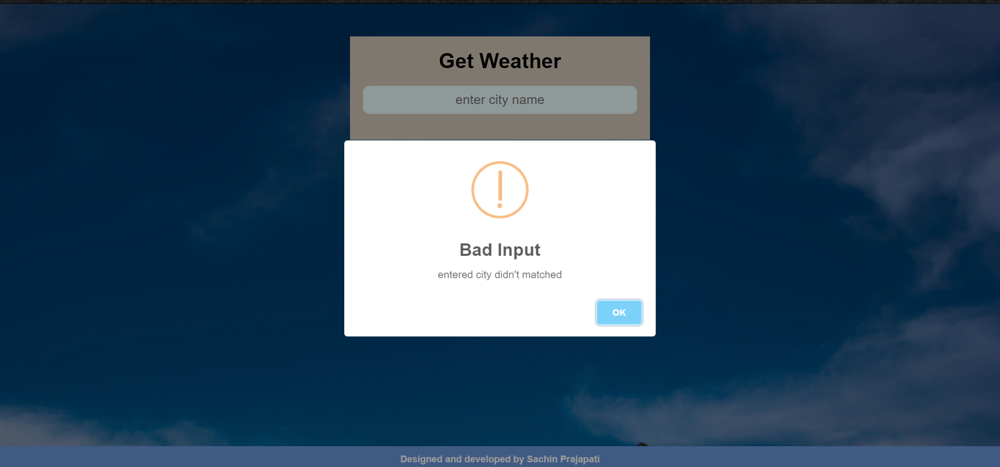
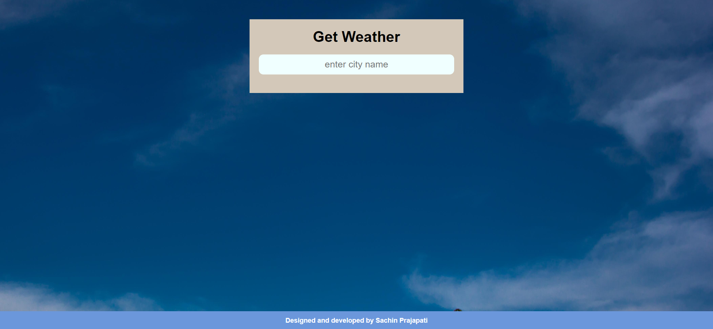

# 🌦️ Weather Web App

A responsive weather application built using HTML, CSS, and JavaScript that provides real-time weather information for cities worldwide using the OpenWeatherMap API.

The application allows users to search for any city and instantly view current weather conditions, temperature, humidity, pressure, wind speed, and other relevant weather details. The UI dynamically adapts with weather-specific backgrounds and icons to provide a more engaging user experience.

---


---

## 📸 Screenshots

### Default View


### Weather Information Display



### Empty Input Validation



### Invalid City Handling


---

## ✨ Features

- 🔍 Search weather by city name
- 🌡️ Real-time temperature information
- 📉 Minimum and maximum temperature display
- 💨 Wind speed information
- 💧 Humidity monitoring
- 🌍 Country-based location display
- 🌡️ Feels-like temperature
- 📊 Atmospheric pressure information
- 🎨 Dynamic background images based on weather conditions
- ☁️ Dynamic weather icons
- ⚠️ Input validation and error handling
- 📱 Fully responsive user interface
- ⚡ Fast API-based weather retrieval

---

## 🛠️ Technologies Used

- HTML5
- CSS3
- JavaScript (ES6)
- OpenWeatherMap API
- SweetAlert (for alerts and notifications)

---

## 📂 Project Structure

```text
Weather_webApp/
│
├── index.html
├── style.css
├── script.js
│
├── img/
│   ├── bg.jpg
│   ├── clear.jpg
│   ├── clouds.jpg
│   ├── drizzle.jpg
│   ├── mist.jpg
│   ├── rainy.jpg
│   ├── snow.jpg
│   ├── sunny.jpg
│   └── thunderstrom.jpg
│
├── ss/
│   ├── demo.png
│   ├── demo1.png
│   ├── empty.png
│   └── bad.png
│
└── README.md
```

---

## ⚙️ How It Works

1. User enters a city name.
2. The application sends a request to the OpenWeatherMap API.
3. Weather data is fetched in JSON format.
4. JavaScript processes the response.
5. Weather details are displayed dynamically.
6. Background images and weather icons update according to current weather conditions.

---

## 🔌 API Integration

This project uses the OpenWeatherMap Current Weather API.

Example API Request:

```http
https://api.openweathermap.org/data/2.5/weather?q=London&appid=YOUR_API_KEY&units=metric
```

Data Retrieved:

- City Name
- Country
- Temperature
- Minimum Temperature
- Maximum Temperature
- Feels Like Temperature
- Humidity
- Pressure
- Wind Speed
- Weather Status

---


```javascript
const weatherApi = {
    key: "YOUR_API_KEY",
    baseUrl: "https://api.openweathermap.org/data/2.5/weather"
}
```

### Run the Application

Simply open:

```bash
index.html
```

or use VS Code Live Server.

---

## 🎯 Learning Outcomes

This project helped strengthen understanding of:

- REST API Consumption
- Fetch API
- JSON Data Handling
- DOM Manipulation
- Event Handling
- Asynchronous JavaScript
- Error Handling
- Responsive Web Design
- Dynamic UI Updates

---

## 🔮 Future Improvements

- 📍 Current Location Weather Detection
- 📅 5-Day Weather Forecast
- 🌙 Dark Mode
- 🌎 Multi-language Support
- ⭐ Favorite Cities
- 📈 Weather Analytics Dashboard
- 🔔 Severe Weather Alerts

---

## 👩‍💻 Author

**Jahanvi Bagjani**

- GitHub: https://github.com/JAHANVI88
- LinkedIn: https://www.linkedin.com/in/jahanvi-bagjani-400390314

---

## 📄 License

This project is licensed under the MIT License.

---

⭐ If you found this project helpful, consider giving it a star on GitHub.
